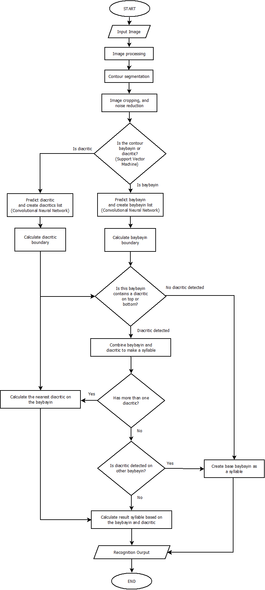

# Baybayin Handwritten Script Recognition using Tensorflow and CV2

Baybayin Handwritten Script Recognition using Tensorflow and CV2 is a machine learning project that classify handwritten Baybayin characters using a convolutional neural network. Baybayin is an ancient script used in the Philippines, and this project seeks to preserve and promote the script by developing a system that can accurately recognize and interpret handwritten Baybayin characters. This model is trained with 17,000 baybayin scripts and 2,000 diacritics. The datasets are seperated into training and validation, which are seperated into 80% and 20% respectively. This two datasets are trained seperately into model-baybayin.keras and model-diacritics.keras.


## Discussion


I initially used pygame for the front-end of the application, letting the user draw on the window. It can easily pass data to image_process.py since pygame is written in Python. I later used HTML, CSS, and Javascript for the front-end of the application. I used the canvas in Javascript for the drawing mechanism, but the difficulty is how to pass the canvas image into Python. So I used Flask to pass the image, and Javascript passed the image (which is in the form of a data URL) into Flask using the POST request method. Then, Flask converts the received data URL into an image file. After converting into a proper image file, it calls the process function from image_process.py, which processes and predicts the syllables in the image drawn in the application.

The image processing and detection algorithm follow my OCR system, based on the research conducted by Pino, R., et al. al. (2021).  The support vector machine differentiates baybayin and diacritics in the image, and then a convolutional neural network predicts baybayin and diacritics separately. It is important to separate baybayin and diacritics, as they serve different functions. The baybayin provides a base syllable, for example, 'ba', and the diacritic modifies the vowels in the baybayin; for example, if it has a dot on the bottom, the 'ba' will be a 'be' or 'bi'. 

Secondly, it is much more effective at identifying the resulting syllable, as the modification of the diacritic is hard for the convolutional neural network to detect. So it separates them two and returns a list of baybayin and diacritics. After that, it iterates on every baybayin to see if there is a dicritic present at the top or bottom of the bounds of the baybayin. If so, it will check if there are multiple diacritics present; if so, it will calculate which of the nearest diacritics are available and then set it as its child. After that, the selected diacritic will detect if there is any other baybayin that selects them as a child; if so, it will calculate which is the nearest and set it as the final syllable pair.

The current baybayin script handwritten detection scripts yield a train accuracy of 98.16% and a validation accuracy of 97.82%. I tested AlexNET as an architecture for this model, but it yielded much poorer results, having an accuracy of 96.71%, and in my real-world test, it is having a hard time predicting my baybayin handwriting accurately.

## Created OCR system in the image_process.py



## Run Locally

1.) Clone the project

```bash
  git clone https://github.com/clarencelubrin/baybayin-script-recognition
```
2.) Go to the directory

```bash
  cd baybayin-script-recognition
```

3.) Open app.py using python

```bash
  python app.py
```


## Findings
(a) Convolutional Neural Network
    epoch: 16
    accuracy: 0.9816 - loss: 0.0677 - val_accuracy: 0.9782 - val_loss: 0.0775

```Python
    model = tf.keras.models.Sequential([
        tf.keras.layers.Conv2D(32, (3,3), activation='relu', input_shape=(50, 50, 1)),
        tf.keras.layers.Conv2D(64, (3,3), activation='relu'),
        tf.keras.layers.MaxPooling2D(2,2),
        tf.keras.layers.Flatten(),
        tf.keras.layers.Dropout(0.2),
        tf.keras.layers.Dense(128, activation='relu'),
        tf.keras.layers.Dense(17, activation='softmax')
    ])
```
(b) AlexNET
    epoch: 32
    accuracy: 0.9671 - loss: 0.1168 - val_accuracy: 0.9728 - val_loss: 0.0820 - learning_rate: 6.5610e-11
```Python
    model = tf.keras.models.Sequential([
        tf.keras.layers.Conv2D(96, (11,11), strides=4, padding='same', activation='relu', input_shape=(227,227,1)),
        tf.keras.layers.MaxPooling2D((3,3), strides=(2,2), padding='valid'),

        tf.keras.layers.Conv2D(256, (3,3), strides=1, padding='same', activation='relu'),
        tf.keras.layers.MaxPooling2D((3,3), strides=(2,2), padding='valid'),

        tf.keras.layers.Conv2D(384, (3,3), strides=1, padding='same', activation='relu'),
        tf.keras.layers.Conv2D(384, (3,3), strides=1, padding='same', activation='relu'),
        tf.keras.layers.Conv2D(256, (3,3), strides=1, padding='same', activation='relu'),
        tf.keras.layers.MaxPooling2D((3,3), strides=(2,2), padding='valid'),

        tf.keras.layers.Flatten(),
        tf.keras.layers.Dense(4096, activation='relu'),
        tf.keras.layers.Dropout(0.5),  # dropout after dense
        tf.keras.layers.Dense(4096, activation='relu'),
        tf.keras.layers.Dropout(0.5),  # dropout after dense
        tf.keras.layers.Dense(17, activation='softmax')
    ])
```
## References

Pino, R., et. al. (2021). Optical character recognition system for Baybayin scripts using support vector machine. Retrieved from: https://peerj.com/articles/cs-360/#p-13

Mendoza, R., et. al. (2022). Block-level Optical Character Recognition System
for Automatic Transliterations of Baybayin Texts
Using Support Vector Machine. Retrieved from: https://philjournalsci.dost.gov.ph/images/pdf/pjs_pdf/vol151no1/block_level_optical_character_recognition_system_.pdf

Pino, R. (2021). Baybayin and Latin (Binary) Images in .mat Format. Retrieved from: https://www.kaggle.com/datasets/rodneypino/baybayin-and-latin-binary-images-in-mat-format

Nogra, J. (2019). Baybayín (Baybayin) Handwritten Image. Retrieved from: https://www.kaggle.com/datasets/jamesnogra/baybayn-baybayin-handwritten-images
